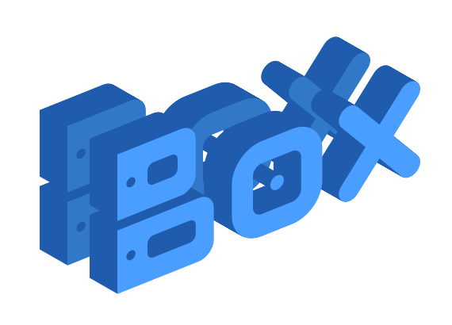
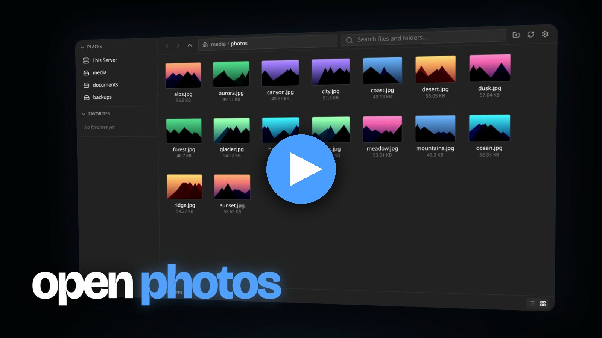
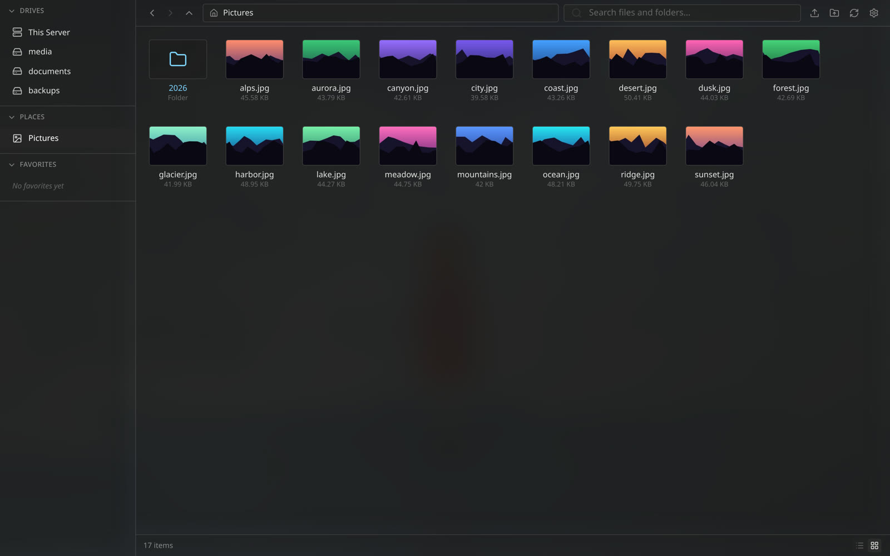
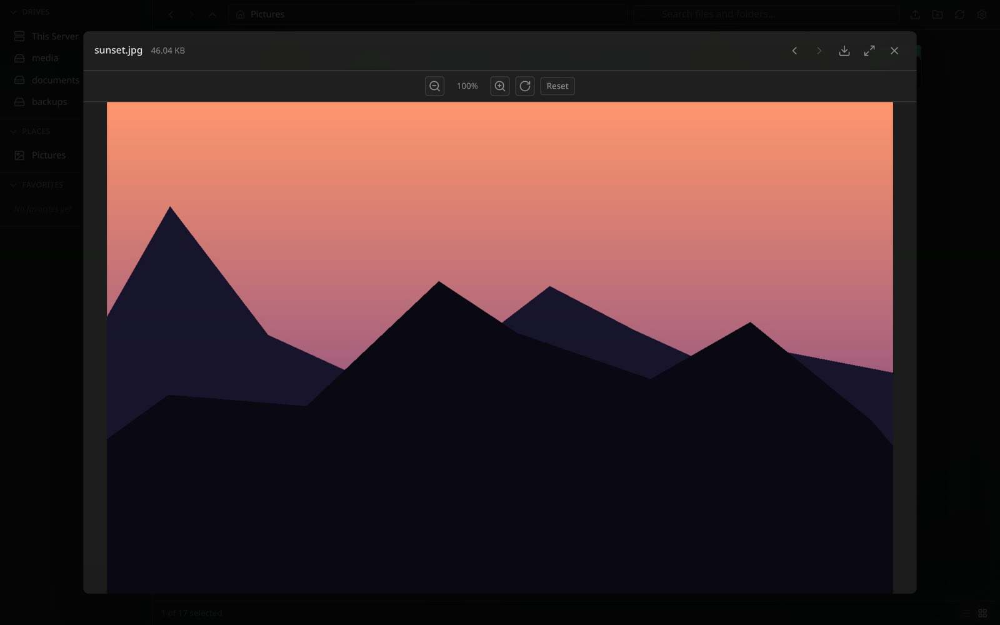
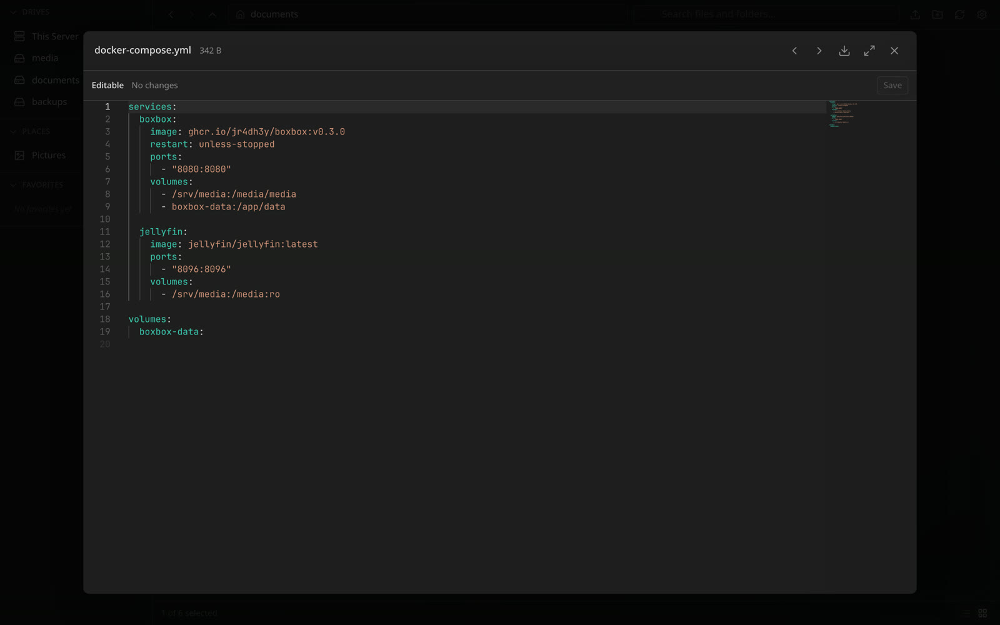
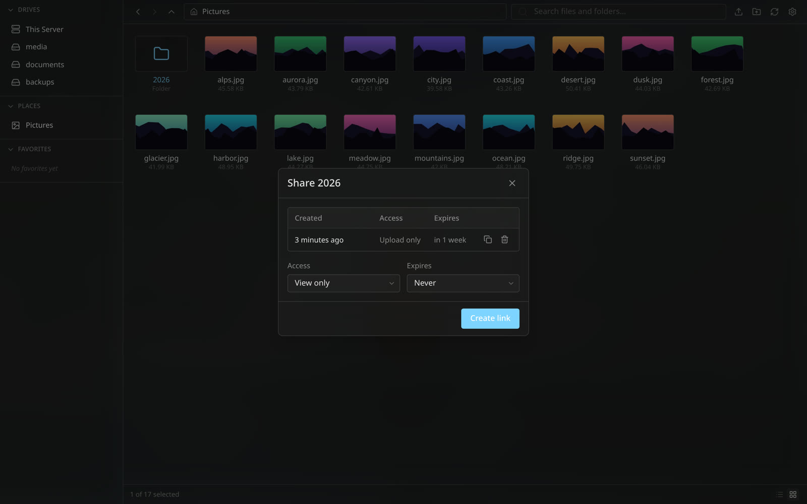
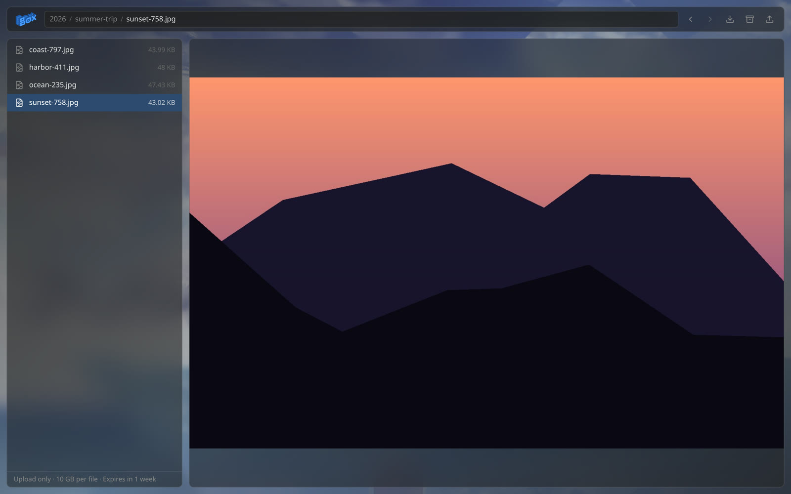

<p align="center">
  
</p>

<h1 align="center">BoxBox</h1>

<p align="center">
  <strong>A modern, self-hosted file manager for your homelab</strong>
</p>

<p align="center">
  <a href="https://github.com/jR4dh3y/BoxBox/releases/latest"></a>
  
  
  
  
  
</p>

<p align="center">
  <a href="https://boxbox.radhey.dev">Website</a> ·
  <a href="https://boxbox.radhey.dev/docs/quickstart/">Quick start</a> ·
  <a href="https://boxbox.radhey.dev/docs/">Docs</a> ·
  <a href="https://github.com/jR4dh3y/BoxBox/releases">Releases</a>
</p>

BoxBox is a self-hosted file manager for homelab and NAS-style servers. It provides a browser UI for mounted Linux paths, large file and folder uploads, previews, code editing, search, share links, and background file operations.

<p align="center">
  <a href="https://youtu.be/cv2_oNkhYI0">
    
  </a>
  <br>
  <sub>Watch BoxBox in 40 seconds <a href="https://youtu.be/cv2_oNkhYI0">on YouTube</a>. Music: <a href="https://www.youtube.com/watch?v=LL9VJAljSQs">“the kill 2” by Lex Amarni &amp; 2muchmotion</a>.</sub>
</p>

## Quick Start

The preferred deployment path is Docker Compose using the published GitHub Container Registry image. No source checkout is required.

```bash
mkdir -p boxbox
cd boxbox

curl -fsSLO https://raw.githubusercontent.com/jR4dh3y/BoxBox/master/docker-compose.yml
curl -fsSLO https://raw.githubusercontent.com/jR4dh3y/BoxBox/master/.env.example
mkdir -p backend
curl -fsSL https://raw.githubusercontent.com/jR4dh3y/BoxBox/master/backend/config.yaml -o backend/config.yaml

cp .env.example .env
$EDITOR .env

docker compose pull
docker compose up -d
```

Generate the bcrypt value requested by `.env`, then open `http://localhost:8080` and sign in as `admin` with the plaintext password you hashed. For reverse proxy examples, local source builds, and update workflows, see [docs/docker.md](docs/docker.md).

## Features

- Browse multiple configured mount points from one web UI, with drives and folder shortcuts (places) listed separately.
- Upload large files and whole folders with chunked, resumable uploads that keep nested paths intact.
- Preview images, audio, video, PDF, and documents, and edit text and code in the built-in Monaco editor.
- Share files and folders with expiring, revocable links. Access levels are View only, Upload only, Upload + delete, and Full access. Recipients see your wallpaper.
- Download folders as ZIP archives from the browser or a public share page.
- Copy, move, and delete files through background jobs with live WebSocket progress.
- Search directories by file or folder name.
- Configure read-only mounts, users, rate limits, and allowed origins.

## Screenshots

<table>
  <tr>
    <td width="50%"><br><sub>Browse drives and places</sub></td>
    <td width="50%"><br><sub>Preview without downloading</sub></td>
  </tr>
  <tr>
    <td width="50%"><br><sub>Edit configs in the browser</sub></td>
    <td width="50%"><br><sub>Create share links per file or folder</sub></td>
  </tr>
  <tr>
    <td colspan="2"><br><sub>Recipients browse, preview, and download without an account</sub></td>
  </tr>
</table>

## What's New in v0.3.0

- **File and folder sharing.** Token links with View only, Upload only, Upload + delete, or Full access, optional expiry, revocation, and ZIP download.
- **Folder uploads.** Pick or drop whole folders. Nested paths are kept.
- **Drives and places.** Top-level mounts are drives; nested mounts show up under Places. Set `kind` to override.
- **Owner wallpaper on share pages.** Your wallpaper is stored on the server and shown to recipients.
- **Port 8080 by default.** The container listens on `8080` instead of `80`. See the [upgrade notes](https://boxbox.radhey.dev/docs/release/) before updating.

## Repository Layout

```text
backend/      Go API server and embedded frontend host
frontend/     SvelteKit application
docs/         Public project documentation
scripts/      Local development helpers
Dockerfile    Unified frontend/backend production image
```

## Documentation

Full documentation lives at [boxbox.radhey.dev/docs](https://boxbox.radhey.dev/docs/). Release and upgrade notes are in [docs/release.md](docs/release.md).

## License

MIT. See [LICENSE](LICENSE).

The promo video uses “the kill 2” by Lex Amarni & 2muchmotion. The song is credited to its artists and is not covered by the MIT license.
